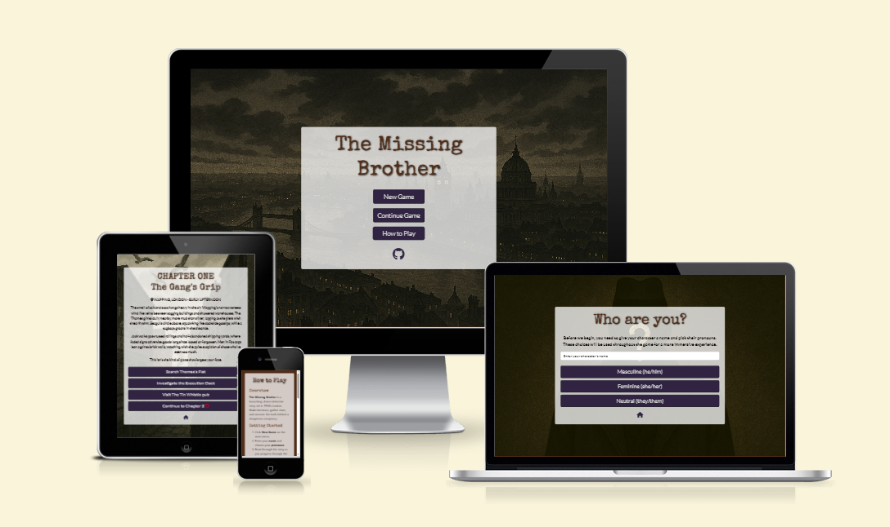
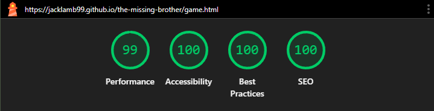

# The Missing Brother

**'The Missing Brother'** is a narrative-driven, noir-style detective game set in 1950s London. Built entirely in HTML, CSS, and JavaScript, the game lets players take on the role of a private investigator. Through branching narratives, item collection, clue-based decision-making, and dice-roll risk systems, players uncover a dark conspiracy. View the live site [here](https://jacklamb99.github.io/the-missing-brother/index.html).

## User Stories

The game was developed with a player-focused approach, below are the user stories that guided the development process, along with explanations and visual examples of how each one was addressed.

1. "As a new player first opening the website, I want easily understand where to go next, so that I can start a game without unnecessary navigation."

- The landing page for the wesbite features a simple menu ui with the title of the game and three simply named buttons to start a new game, continue an existing game and navigate to a 'How to Play' page.

    

Landing Page

    

    

2. "As a new player, I want to be able to understand what the game is about and how to play, so that I am as prepared as possible when starting a new game."

- The site includes a detailed 'How to Play' page which gives an overview of the game, how to get started, the icons to look for in the game and what they mean.

    

'How to Play' Page

    

    

3. "As a new player, I want to input my name and pronouns at the start, so that the game can personalise the story to reflect mine or my character's identity."

- Upon starting a new game, players are taken to a character creation menu, allowing them to enter a name for their character and choose their pronouns, both of which will then be used throughout the game to create a more immersive experience. There is also logic in place to 'normalise' name inputs *(i.e. convert "jOhN sMiTh" to "John Smith").*

    

Character Creation

    

    

4. "As a player exploring the game, I want to experience different types of scenes, so that gameplay feels varied and not monotonous."

- A variety of scene 'types' are incorporated into the game, including 'Searches', 'Dialogue' and 'Action'.

    

Varied Scenes

    

    

5. "As a player interacting with NPCs, I want to make dialogue choices, so that I can influence the outcome of scenes and learn critical information."

- From the start of the game, players are given scenes with multiple dialogue option that lead to a variety of outcomes and chances to learn new information.

    

Choice-Based Dialogue

    

    

6. "As a player exploring scenes, I want to collect items in an inventory, so that I can use them to unlock new paths or survive later encounters."

- Some scenes, through searches or action, result in the player collecting an item that is vital to the success of later decisions.

    

Inventory System

    

    

7. "As a player choosing different actions, I want to experience consequences that affect the storyline, so that my decisions lead to different outcomes, including potential failure states."

- The game includes choices with branching outcomes that can result in success or game-ending failure, dependent on their previous choices and items collected.

    

Branching Narratives

    

    

8. "As a player in a detective themed game, I want to collect clues or evidence, so that I can access additional choices or make more informed decisions."

- Some scenes, accessed through searches or correct dialogue choices, result in the player collecting clues and evidence that allow them to make the correct choices elsewhere.

    

Clue and Evidence Tracking

    

    

9. "As a player attempting risky actions, I want a chance-based system to determine the outcome, so that I feel tension and unpredictability during critical scenes."

- The game features 'Action' scenes that require the player to pick between a low-risk dice roll with a lower threshold for success but no second chance, or a high-risk roll with a higher threshold but a second chance if it fails.

    

Dice Roll Mechanics

    

    

10. "As a player progressing through a linear story, I want to be locked out of scenes once I choose to leave them, so that my choices carry real weight and the game maintains narrative tension."

- Throughout the game, players are provided with the option to leave the location, but most can't be returned to once that decision is made.

    

Scene Locking

    

    

11. "As a player moving through the story, I want to see a unique background image for each scene or location, so that I stay immersed in the noir atmosphere of 1950s London."

- The game incorporates multiple unique backgrounds based on the location in which the scene takes place, allowing the players to immerse themselves in the theme of the game while they progress through the narrative. Additional logic is in place to change the background dynamically based on the orientation of their chosen device, meaning the most appropriately sized image is always used.

    

Background Example

    

    

12. "As a player returning to the game, I want to be able to continue an existing game, so that I can pick up where I left off without having to repeat scenes I've already completed."

- Whenever the game is advanced to a new scene, logic is in place to save the player's progress to their local storage. So if players choose to navigate to the landing page or leave the game entirely, they can return to their latest scene by simply selecting the 'Continue' option from the main menu.

    

Continued Progress

    

    

## Design

### Wireframes

The follwing wireframes guided the site’s structure and layout across desktop, tablet and mobile devices.

Index Page Wireframes

Game Page Wireframes

'How to Play' Page Wireframes

### Colour Palette

The colour scheme draws inspiration from vintage noir cinema, 1950s pulp fiction, and cold war-era detective thrillers. It uses deep, muted tones and strong contrast to reinforce the dark, moody atmosphere of a mystery set in post-war London. The palette is consistent with the game's themes of mystery and tension, enhancing immersion at every stage.

- **#302442** - Used for buttons, this deep purple-grey evokes a sense of secrecy and subdued tension, aligning with the game’s noir aesthetic.
- **#563457** - A richer, more saturated variation used for button hover states, giving the user clear feedback and drawing attention to interactive elements.
- **#522D17** - A dark brown-red used for headings, reminiscent of classic 'file folders' or tobacco, both classic staples of noir imagery.
- **#0B0201** - A near-black tone but a hint of brown used for body text, ensuring high readability while visually complimenting the headings.

**Contrast and Legibility** - All game headers, text and buttons are set over a light, semi-transparent overlay, allowing background visuals to be seen but not interfere with text legibility. Meeting WCAG contrast guidelines to support accessibility.

**Consistency** - The colour palette is applied across buttons, text, and backgrounds to maintain visual cohesion and narrative tone.

**Focus** - Accent tones are used for hover states to help guide player attention without breaking immersion.

### Background Imagery

The scene backgrounds complement the core palette with desaturated hues, low lighting, and muted contrasts - often depicting fog, rain, or artificial light. These visual themes reinforce a feeling of urban isolation and moral ambiguity consistent with 1950s noir.

### Typography

The site uses two fonts imported from Google Fonts to support both clarity and aesthetic impact:

- **Special Elite** for headers (typewriter/pulp look)
- **Lato** for readable body text

### Responsive UI

Headings, text and interactive elements adapt based on screen size. Game layout is fully responsive across:

- Desktop
- Tablet
- Mobile

## Testing

### Compatibility and Responsiveness

All pages were tested in Google Chrome, Microsoft Edge, Mozilla Firefox, and Safari to ensure full responsiveness and compatibility with a range of screen sizes, including mobile and ultra-wide monitors. Tests were carried out in accordance with [WCAG 2.1 Reflow](https://www.w3.org/WAI/WCAG21/Understanding/reflow.html) standards.

Devices tested

- 1920×1080 desktop monitor
- Google Chromebook laptop
- Apple iPad Air tablet
- Samsung Galaxy S20 mobile
- Apple iPhone 12 mobile

Steps to Test

1. Open the browser and navigate to 'The Missing Brother' website.
2. Open developer tools (right-click then Inspect).
3. Set the device to "Responsive" with width starting at 320px.
4. Zoom out to 50% to view full scaling on larger resolutions.
5. Drag the width toggle to test all breakpoints up to ultra-wide (2560px+).

Expected Behaviour

- No horizontal scroll, no overlapping elements, and all content remains readable and visually balanced.

Actual Result

- Worked as expected - The website responded as expected across all tested screen sizes and devices. No layout issues or horizontal scrollbars were detected.

### Functional Testing

Manual testing involves going through the website to check that everything works as it should. The testing involves clicking buttons, filling out forms, and interacting with features just like a typical user would. It's especially useful for testing things like user experience, visual layout, and interactions. Manual testing is ideal for catching unexpected issues and getting a feel for how the project behaves in real-world use.

The following tests were conducted:

#### Character Creation Input

Test Process

1. Load the character creation screen.
2. Enter a name with with studly caps *(e.g. "jOhN sMiTh")*.
3. Select pronouns *(e.g. "Masculine")* to start the game.
4. Proceed through the scenes and read through the narratives.

Expected Behaviour

- The player's 'normalised' name *(e.g. "John Smith")* and chosen pronouns should dynamically populate throughout all game narratives.

Actual Result

- Works as expected - Name and pronoun variables correctly updated in real time across all subsequent scenes, dialogue boxes, and narration.

#### Flag Setting

Test Process

1. Trigger specific choice interactions that amend a flag to true *(e.g. an item, clue or evidence)*.
2. Open the console and inspect the relevant boolean variables *(e.g. `hasKnifeItem = true`)*.

Expected Behaviour

- Associated flags should change from null to true in the console upon selection of the choice. These flags should impact available options in future scenes.

Actual Result

- Works as expected - Flags correctly set in the background. Conditional checks against these flags controlled future content as expected.

#### Choices Requiring Items

Test Process

1. Collect 'bank notes' and 'knife' items.
2. Proceed to the `pubChoiceRowley` scene.
3. Choose the 'bribe him' and 'threaten him' options.
4. Repeat steps 2 and 3 without collecting required items.

Expected Behaviour

- If required items have been collected, branches should follow the success logic. If required items haven't been collected, branches should follow failure logic.

Actual Result

- Works as expected - Item flags correctly influenced options and led to resulting scenes.

#### Dice Roll Logic

Test Process

1. Enter a scene requiring a dice roll *(e.g. 'Execution Dock' charge/sneak encounter)*.
2. Select a choice to roll the virtual dice and trigger the resulting alart.
3. Repeat until both successful and unsuccessful attempts are achieved.

Expected Behaviour

- The dice roll should generate a number between 1–12. Correct logic should determine success/failure based on the target threshold *(e.g., ≥8 = success)*.

Actual Result

- Works as expected - Dice roll followed randomised outcome logic and results alart functioned as expected. Success or failure correctly triggered the expected following scene.

#### Locked Scene Navigation

Test Process

1. Select an option to leave a scene or location *(e.g. 'Leave the flat')*.
2. Attempt to return to the same scene.

Expected Behaviour

- Visited scene flag should be amended to true in the console *(e.g. `visitedFlat = true`)* and the option to return to that scene should no longer be visible, preventing backtracking by locking each visited location.

Actual Result

- Works as expected - Scene-visited flags were amended to true as expected, locking the scene and preventing re-entry.

#### Scene Background Rendering

Test Process

1. Visit each scene and observe the background image loaded.
2. Resize screen and rotate device to test portrait/landscape swaps.

Expected Behaviour

- Each scene should load the correct background image (landscape or portrait version).

Actual Result

- Works as expected - Images loaded correctly across all scenes. Portrait versions activated on narrower viewports.

#### How to Play Page

Test Process

1. Click the 'How to Play' button from the main menu to navigate to the 'How to Play' page.
2. Read through instructional content.
3. Click the 'Back to Main Menu' button at the bottom of the page to navigate back to the landing page.

Expected Behaviour

- Buttons should navigate to the correct pages without error. Instructions should be clearly visible and styled consistently.

Actual Result

- Works as expected - Navigation buttons worked without issue and content displayed correctly and clearly.

#### 404 Page

Test Process

1. Enter an invalid url into the browser (e.g. https://jacklamb99.github.io/the-missing-brother/what)
2. Click the 'Back to Main Menu' button at the bottom of the page to navigate back to the landing page.

Expected Behaviour

- Should be navigated to the custom 404.html page and the 'Back to Main Menu' button should navigate back to the landing page.

Actual Result

- Works as expected - Displayed custom 404 page and navigation buttons worked without issue

### Validation

#### HTML

No errors occurred when passing each page through the official [W3C Markup Validation Service](https://validator.w3.org/). A warning was shown for an empty heading on the game.html page, but this is expected as the heading is populated by the background scene-loading logic.

Index Page Validator Results

Game Page Validator Results

'How to Play' Page Validator Results

404 Page Validator Results

#### CSS

No errors occurred when passing through the official [W3C CSS Validation Service](https://jigsaw.w3.org/css-validator/)

CSS Validator Results

#### JavaScript

No errors occurred when passing though the [JS Hint Validation Service](https://jshint.com/). Any warnings about unused functions relate to functions called in seperate JavaScript files.

### Lighthouse

Lighthouse was run in Google Chrome DevTools for all pages to assess Performance, Accessibility, Best Practices, and SEO.

Index Page Lighthouse Results

Game Page Lighthouse Results

'How to Play' Page Lighthouse Results

404 Page Validator Lighthouse

### Bugs

During development, I initially planned to use an external library to handle the dice roll mechanic. This would have provided both the logic and a matching visual animation to enhance the experience. While the system worked correctly on desktop during testing, I discovered that it failed to function on mobile devices once deployed. I explored multiple fixes, including implementing custom fallback logic in case the external library couldn't load, but couldn't get both systems to work together reliably. Since the issue was game-breaking on mobile and the animation was purely cosmetic, I made the decision to remove the external mechanic entirely and rely on the custom JavaScript dice roll logic instead.

## Technologies

The following technologies were used in the creation of the website:

- [HTML](https://developer.mozilla.org/en-US/docs/Web/HTML) - The structure of the website was built using semantic HTML.
- [CSS](https://developer.mozilla.org/en-US/docs/Web/CSS) - Custom CSS was used to style all pages and ensure consistent design.
- [JavaScript](https://developer.mozilla.org/en-US/docs/Web/JavaScript) - Custom JavaScript was used for interactive logic and game mechanics
- [Bootstrap 5](https://getbootstrap.com/) - Used for responsive layout, spacing and modals.
- [Visual Studio Code](https://code.visualstudio.com/) - The project was developed using the VS Code desktop application.
- [GitHub](https://github.com/) - The source code is hosted on GitHub and deployed using GitHub Pages.
- Git - Used for version control, including commits and pushing code throughout the development process.
- [Google Fonts](https://fonts.google.com/) - Used to import the 'Special Elite' and 'Lato' fonts for headings and body text.
- [Favicon.io](https://favicon.io/) - Used to convert and import a custom image as a favicon.
- [Font Awesome](https://fontawesome.com/) - Used to find and import icons used throughout the website.
- [Balsamiq](https://balsamiq.com/wireframes/desktop/) - Wireframes were created using the Balsamiq desktop application.
- [Free Convert](https://www.freeconvert.com/) - Used to convert all images to WEBP format for improved compression without quality loss.
- [Night Cafe](https://creator.nightcafe.studio/) - Used to create the custom background images based on scene descriptions.

## Deployment

### Version Control

The project was developed using the VS Code desktop application and pushed to the remote repository, [the-missing-brother](https://github.com/JackLamb99/the-missing-brother), on GitHub.

The following git commands were used in the terminal throughout its creation to push code to the remote repository:

- `git add [file]` or `git add .` - This command was used to add the file(s) to the staging area before they were committed.
- `git commit –m "[commit message]"` - This command was used to commit changes to the local repository queue.
- `git push` - This command was used to push all committed code to the remote repository on GitHub.

### Deployment to GitHub Pages

The site was deployed to GitHub Pages, the steps to deploy are as follows:

1. In your GitHub repository, navigate to the *Settings* tab.
2. In the left-hand menu, click on *Pages*.
3. Under the *Build and deployment* section, select *Deploy from a branch*.
4. In the *Branch* dropdown, choose *main* (or the appropriate branch) and leave the folder set to */ (root)* if it appears.
5. Click *Save*.
6. After a few moments, a live link to the deployed site will appear at the top of the page.
 *Note: You may need to refresh the page to see the link after saving.*

The live link can be found here - https://jacklamb99.github.io/the-missing-brother/

### Cloning the Repository Locally

1. Open the GitHub repository you want to clone.
2. Click the green *Code* button under the repository name.
3. Under the *HTTPS* tab, click the copy icon next to the repository URL.
4. Open your IDE or terminal.
5. In the terminal, type the following command, replacing copied-url with the one you copied:
`git clone copied-url`
 *Note: Git must be installed on your system for this step to work. You can download it [here](https://git-scm.com/downloads).*

## Future Developments

While 'The Missing Brother' currently includes a fully playable Prologue and Chapter One, there are several features and improvements that could be added in future updates to expand and enhance the experience:

### Additional Chapters

The full narrative structure would include Chapters 2, 3, and a finale (Chapter 4), each introducing new scenes, locations, and deeper layers of the central conspiracy. Future development could involve implementing these chapters with the same attention to branching logic, item collection, and decision consequences already seen in Chapter One.

### External Dice Roll Mechanic

As previously mentioned in the [bugs section](#bugs), an external library was originally used to animate dice rolls with a visual result, but it caused game-breaking issues on mobile devices. A future development could be to resolve this compatibility problem, either by fixing the integration or replacing it with a lightweight, mobile-friendly alternative, so players can enjoy both the functionality and immersive animation across all devices.

### Audio & Sound Effects

To further immerse players in the noir atmosphere, future versions of the game could include background music, ambient sounds, and audio cues *(e.g. rain, footsteps, dice rolls)*. These additions would help reinforce mood, tension, and setting during key moments of gameplay.